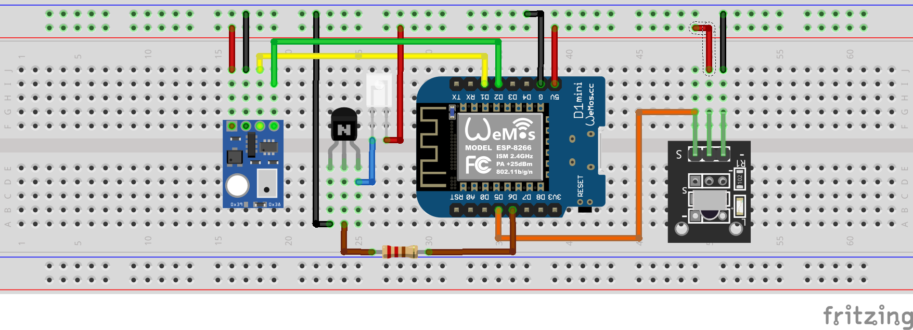

# ESP8266-Electra-AC-RC08C

This project enables control of Electra AC units that use the RC08C IR remote through Home Assistant (HA). Unlike traditional universal remote solutions like Broadlink, this project provides feedback and status updates to HA even when the air conditioner is operated using the traditional remote.

## Hardware Requirements

### Main Controller
- WeMos D1 Mini TYPE-C ([Buy Here](https://www.aliexpress.com/item/1005007877904928.html))

### Sensors
- AHT10 High Precision Digital Temperature and Humidity Sensor ([Buy Here](https://www.aliexpress.com/item/1005006054547297.html))
- KY-022 IR Infrared Sensor Receiver ([Buy Here](https://www.aliexpress.com/item/1005006924353029.html))

### IR Transmitter Options
Choose one of the following:
1. DIY Solution (Tested & Working):
   - IR LED
   - S9014 Transistor (NPN)
   - 220Ω Resistor

2. Pre-built Modules (Not Tested):
   - PCB0100 2 Channel Infrared Transmitter ([Buy Here](https://www.aliexpress.com/item/32860595867.html))
   - IR Infrared Transmitter Module IR Digital 38khz ([Buy Here](https://www.aliexpress.com/item/1005006385368806.html))

## Diagrams

### Schematic diagram

### Breadbord layout

